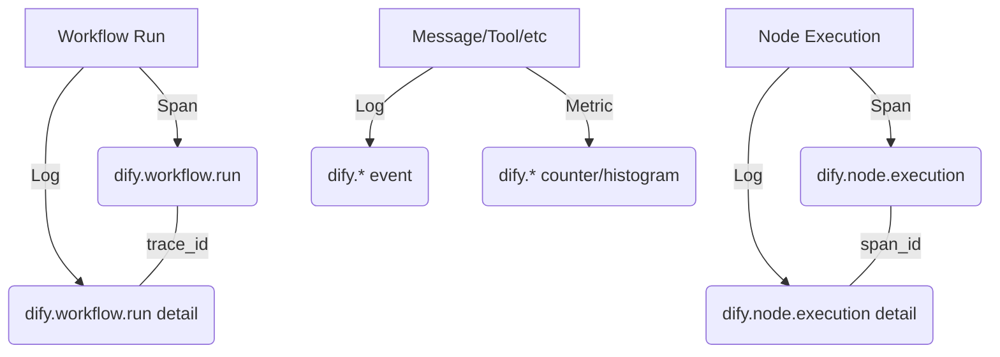

# 읽어보기

- 원문 저장소: `langgenius/dify`
- 미러 저장소: `martinlee-git/dify`
- 원문 문서: https://github.com/langgenius/dify/blob/main/api/enterprise/telemetry/README.md
- 미러 경로: `api/enterprise/telemetry/README.md`

## 한글 요약

Dify Enterprise Telemetry 이 문서에서는 OTEL(Dify Enterprise OpenTelemetry) 내보내기 도구의 개요와 Prometheus, Grafana, Jaeger 또는 Honeycomb과 같은 관찰 가능성 스택과의 통합을 위해 이를 구성하는 방법을 제공합니다. 개요 Dify Enterprise는 "슬림 스팬 + 풍부한 컴패니언 로그" 아키텍처를 사용하여 과도한 추적 저장 없이도 높은 충실도의 관찰 가능성을 제공합니다. 추적(범위): 상위 수준 작업(워크플로 및 노드)의 구조, ID 및 타이밍을 캡처합니다. 구조화된 로그: 추적 ID 및 범위 ID를 통해 범위와 상관된 모든 이벤트에 대한 심층 컨텍스트(입력, 출력, 메타데이터)를 제공합니다. 지표: 사용량, 성능 및 오류 추적에 대해 100% 정확한 카운터와 히스토그램을 제공합니다. 신호 아키텍처 구성 Enterprise OTEL 내보내기는 환경 변수를 통해 구성됩니다. | 변수 | 설명 | 기본값 | | | | | | 엔터프라이즈 지원 | 모든 엔터프라이즈 기능을 위한 마스터 스위치입니다. | 거짓 | | 엔터프라이즈 원격 측정 지원 | 엔터용 마스터 스위치

## 핵심 발췌

rprise 원격 측정. | 거짓 | | 엔터프라이즈 OTLP 엔드포인트 | OTLP 수집기 끝점(예: http://otel 수집기:4318) | | | 엔터프라이즈 OTLP 헤더 | OTLP 요청에 대한 사용자 정의 헤더(예: x 범위 orgid=tenant1) | | | 엔터프라이즈 OTLP 프로토콜 | OTLP 전송 프로토콜(http 또는 grpc). | http | | 엔터프라이즈 OTLP API 키 | 인증을 위한 Bearer 토큰입니다. | | | 기업 콘텐츠 포함 | 로그에 민감한 콘텐츠(입력/출력)를 포함할지 여부입니다. | 거짓 | | 엔터프라이즈 서비스 이름 | OTEL에 보고된 서비스 이름입니다. | 신성화하다 | | ENTERPRISE OTEL 샘플링 요금 | 트레이스의 샘플링 속도(0.0~1.0)입니다. 측정항목은 항상 100%입니다. | 1.0 | 상관 모델 Dify는 결정론적 ID 생성을 사용하여 신호가 다양한 서비스와 비동기 작업 간에 상호 연관되도록 합니다. ID 생성 규칙 tra

## 원문 내용

# Dify Enterprise Telemetry

This document provides an overview of the Dify Enterprise OpenTelemetry (OTEL) exporter and how to configure it for integration with observability stacks like Prometheus, Grafana, Jaeger, or Honeycomb.

## Overview

Dify Enterprise uses a "slim span + rich companion log" architecture to provide high-fidelity observability without overwhelming trace storage.

- **Traces (Spans)**: Capture the structure, identity, and timing of high-level operations (Workflows and Nodes).
- **Structured Logs**: Provide deep context (inputs, outputs, metadata) for every event, correlated to spans via `trace_id` and `span_id`.
- **Metrics**: Provide 100% accurate counters and histograms for usage, performance, and error tracking.

### Signal Architecture



## Configuration

The Enterprise OTEL exporter is configured via environment variables.

| Variable | Description | Default |
|----------|-------------|---------|
| `ENTERPRISE_ENABLED` | Master switch for all enterprise features. | `false` |
| `ENTERPRISE_TELEMETRY_ENABLED` | Master switch for enterprise telemetry. | `false` |
| `ENTERPRISE_OTLP_ENDPOINT` | OTLP collector endpoint (e.g., `http://otel-collector:4318`). | - |
| `ENTERPRISE_OTLP_HEADERS` | Custom headers for OTLP requests (e.g., `x-scope-orgid=tenant1`). | - |
| `ENTERPRISE_OTLP_PROTOCOL` | OTLP transport protocol (`http` or `grpc`). | `http` |
| `ENTERPRISE_OTLP_API_KEY` | Bearer token for authentication. | - |
| `ENTERPRISE_INCLUDE_CONTENT` | Whether to include sensitive content (inputs/outputs) in logs. | `false` |
| `ENTERPRISE_SERVICE_NAME` | Service name reported to OTEL. | `dify` |
| `ENTERPRISE_OTEL_SAMPLING_RATE` | Sampling rate for traces (0.0 to 1.0). Metrics are always 100%. | `1.0` |

## Correlation Model

Dify uses deterministic ID generation to ensure signals are correlated across different services and asynchronous tasks.

### ID Generation Rules

- `trace_id`: Derived from the correlation ID (workflow_run_id or node_execution_id for drafts) using `int(UUID(correlation_id))`
- `span_id`: Derived from the source ID using the lower 64 bits of `UUID(source_id)`

### Scenario A: Simple Workflow

A single workflow run with multiple nodes. All spans and logs share the same `trace_id` (derived from `workflow_run_id`).

```
trace_id = UUID(workflow_run_id)
├── [root span] dify.workflow.run (span_id = hash(workflow_run_id))
│   ├── [child] dify.node.execution - "Start" (span_id = hash(node_exec_id_1))
│   ├── [child] dify.node.execution - "LLM" (span_id = hash(node_exec_id_2))
│   └── [child] dify.node.execution - "End" (span_id = hash(node_exec_id_3))
```

### Scenario B: Nested Sub-Workflow

A workflow calling another workflow via a Tool or Sub-workflow node. The child workflow's spans are linked to the parent via `parent_span_id`. Both workflows share the same trace_id.

```
trace_id = UUID(outer_workflow_run_id)     ← shared across both workflows
├── [root] dify.workflow.run (outer) (span_id = hash(outer_workflow_run_id))
│   ├── dify.node.execution - "Start Node"
│   ├── dify.node.execution - "Tool Node" (triggers sub-workflow)
│   │   └── [child] dify.workflow.run (inner) (span_id = hash(inner_workflow_run_id))
│   │       ├── dify.node.execution - "Inner Start"
│   │       └── dify.node.execution - "Inner End"
│   └── dify.node.execution - "End Node"
```

**Key attributes for nested workflows:**

- Inner workflow's `dify.parent.trace_id` = outer `workflow_run_id`
- Inner workflow's `dify.parent.node.execution_id` = tool node's `execution_id`
- Inner workflow's `dify.parent.workflow.run_id` = outer `workflow_run_id`
- Inner workflow's `dify.parent.app.id` = outer `app_id`

### Scenario C: Draft Node Execution

A single node run in isolation (debugger/preview mode). It creates its own trace where the node span is the root.

```
trace_id = UUID(node_execution_id)   ← own trace, NOT part of any workflow
└── dify.node.execution.draft (span_id = hash(node_execution_id))
```

**Key difference:** Draft executions use `node_execution_id` as the correlation_id, so they are NOT children of any workflow trace.

## Content Gating

When `ENTERPRISE_INCLUDE_CONTENT` is set to `false`, sensitive content attributes (inputs, outputs, queries) are replaced with reference strings (e.g., `ref:workflow_run_id=...`) to prevent data leakage to the OTEL collector.

**Reference String Format:**

```
ref:{id_type}={uuid}
```

**Examples:**

```
ref:workflow_run_id=550e8400-e29b-41d4-a716-446655440000
ref:node_execution_id=660e8400-e29b-41d4-a716-446655440001
ref:message_id=770e8400-e29b-41d4-a716-446655440002
```

To retrieve actual content when gating is enabled, query the Dify database using the provided UUID.

## Reference

For a complete list of telemetry signals, attributes, and data structures, see [DATA_DICTIONARY.md](./DATA_DICTIONARY.md).