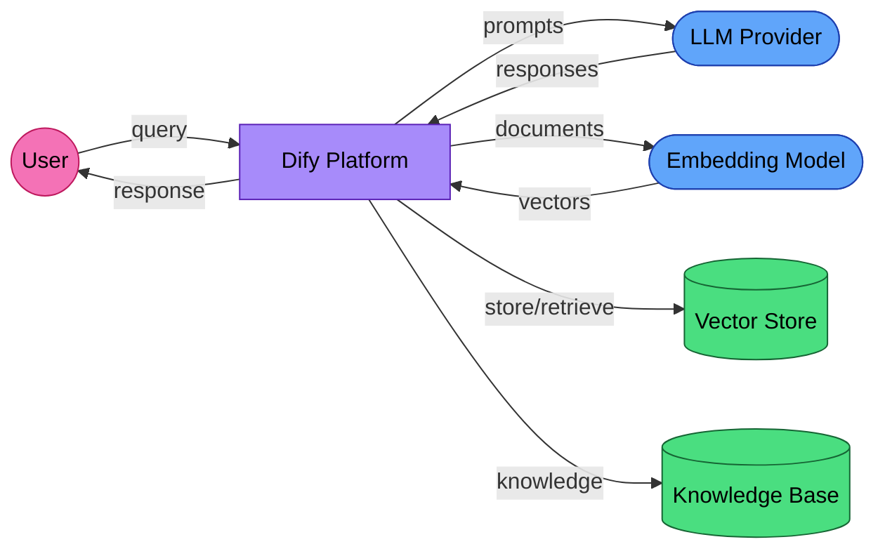

# eu-ai-act-준수

- 원문 저장소: `langgenius/dify`
- 미러 저장소: `martinlee-git/dify`
- 원문 문서: https://github.com/langgenius/dify/blob/main/docs/eu-ai-act-compliance.md
- 미러 경로: `docs/eu-ai-act-compliance.md`

## 한글 요약

Dify 배포자를 위한 EU AI 법 준수 가이드 Dify는 RAG 파이프라인, 에이전트 및 AI 워크플로를 구축하기 위한 LLMOps 플랫폼입니다. 자체 호스팅이든 클라우드 제공업체를 사용하든 관계없이 EU에 Dify를 배포하는 경우 EU AI Act가 배포에 적용됩니다. 이 가이드에서는 규정에서 요구하는 사항과 Dify의 아키텍처가 해당 요구 사항에 어떻게 매핑되는지를 다룹니다. 귀하의 시스템이 범위 내에 있습니까? 제12조, 13조, 14조의 세부 의무는 EU AI 법의 부록 III에 정의된 고위험 AI 시스템에만 적용됩니다. Dify 애플리케이션은 다음 용도로 사용되는 경우 위험이 높습니다. 채용 및 HR - 후보자 선별, 직원 성과 평가, 작업 할당 신용 점수 및 보험 - 신용도 평가 또는 보험료 설정 법 집행 - 프로파일링, 범죄 위험 평가, 국경 통제 중요 인프라 - 에너지, 물, 운송 또는 통신 시스템 관리 교육 평가 - 학생 채점, 입학 결정 필수 공공 서비스 - 적격성 평가

## 핵심 발췌

혜택, 주택 또는 응급 서비스에 대한 대부분의 Dify 배포(고객 대면 챗봇, 내부 지식 기반, 콘텐츠 생성 워크플로)는 위험이 높지 않습니다. 귀하의 Dify 애플리케이션이 위 범주 중 하나에 속하지 않는 경우: 사용자가 애플리케이션과 직접 상호 작용하는 경우 제50조(최종 사용자 투명성)가 여전히 적용됩니다. 아래 제50조 섹션을 참조하세요. 개인 데이터를 처리하는 경우에도 GDPR이 적용됩니다. 아래 GDPR 섹션을 참조하세요. 고위험 의무(제9조 15항)는 적용될 가능성이 낮지만 위험 분류는 상황에 따라 다릅니다. 법적 검토 없이 자체 분류하지 마세요. 기본 의무로서 50조(투명성) 및 GDPR(데이터 보호)에 중점을 둡니다. 귀하의 사용 사례가 고위험에 해당하는지 확실하지 않은 경우 자격을 갖춘 법률 전문가에게 문의하세요.

## 원문 내용

# EU AI Act Compliance Guide for Dify Deployers

Dify is an LLMOps platform for building RAG pipelines, agents, and AI workflows. If you deploy Dify in the EU — whether self-hosted or using a cloud provider — the EU AI Act applies to your deployment. This guide covers what the regulation requires and how Dify's architecture maps to those requirements.

## Is your system in scope?

The detailed obligations in Articles 12, 13, and 14 only apply to **high-risk AI systems** as defined in Annex III of the EU AI Act. A Dify application is high-risk if it is used for:

- **Recruitment and HR** — screening candidates, evaluating employee performance, allocating tasks
- **Credit scoring and insurance** — assessing creditworthiness or setting premiums
- **Law enforcement** — profiling, criminal risk assessment, border control
- **Critical infrastructure** — managing energy, water, transport, or telecommunications systems
- **Education assessment** — grading students, determining admissions
- **Essential public services** — evaluating eligibility for benefits, housing, or emergency services

Most Dify deployments (customer-facing chatbots, internal knowledge bases, content generation workflows) are **not** high-risk. If your Dify application does not fall into one of the categories above:

- **Article 50** (end-user transparency) still applies if users interact with your application directly. See the [Article 50 section](#article-50-end-user-transparency) below.
- **GDPR** still applies if you process personal data. See the [GDPR section](#gdpr-considerations) below.
- The high-risk obligations (Articles 9-15) are less likely to apply, but risk classification is context-dependent. **Do not self-classify without legal review.** Focus on Article 50 (transparency) and GDPR (data protection) as your baseline obligations.

If you are unsure whether your use case qualifies as high-risk, consult a qualified legal professional before proceeding.

## Self-hosted vs cloud: different compliance profiles

| Deployment | Your role | Dify's role | Who handles compliance? |
|-----------|----------|-------------|------------------------|
| **Self-hosted** | Provider and deployer | Framework provider — obligations under Article 25 apply only if Dify is placed on the market or put into service as part of a complete AI system bearing its name or trademark | You |
| **Dify Cloud** | Deployer | Provider and processor | Shared — Dify handles SOC 2 and GDPR for the platform; you handle AI Act obligations for your specific use case |

Dify Cloud already has SOC 2 Type II and GDPR compliance for the platform itself. But the EU AI Act adds obligations specific to AI systems that SOC 2 does not cover: risk classification, technical documentation, transparency, and human oversight.

## Supported providers and services

Dify integrates with a broad range of AI providers and data stores. The following are the key ones relevant to compliance:

- **AI providers:** HuggingFace (core), plus integrations with OpenAI, Anthropic, Google, and 100+ models via provider plugins
- **Model identifiers include:** gpt-4o, gpt-3.5-turbo, claude-3-opus, gemini-2.5-flash, whisper-1, and others
- **Vector database connections:** Extensive RAG infrastructure supporting numerous vector stores

Dify's plugin architecture means actual provider usage depends on your configuration. Document which providers and models are active in your deployment.

## Data flow diagram

A typical Dify RAG deployment:

**GDPR roles** (providers are typically processors for customer-submitted data, but the exact role depends on each provider's terms of service and processing purpose; deployers should review each provider's DPA):
- **Cloud LLM providers (OpenAI, Anthropic, Google)** typically act as processors — requires DPA.
- **Cloud embedding services** typically act as processors — requires DPA.
- **Self-hosted vector stores (Weaviate, Qdrant, pgvector):** Your organization remains the controller — no third-party transfer.
- **Cloud vector stores (Pinecone, Zilliz Cloud)** typically act as processors — requires DPA.
- **Knowledge base documents:** Your organization is the controller — stored in your infrastructure.

## Article 11: Technical documentation

High-risk systems need Annex IV documentation. For Dify deployments, key sections include:

| Section | What Dify provides | What you must document |
|---------|-------------------|----------------------|
| General description | Platform capabilities, supported models | Your specific use case, intended users, deployment context |
| Development process | Dify's architecture, plugin system | Your RAG pipeline design, prompt engineering, knowledge base curation |
| Monitoring | Dify's built-in logging and analytics | Your monitoring plan, alert thresholds, incident response |
| Performance metrics | Dify's evaluation features | Your accuracy benchmarks, quality thresholds, bias testing |
| Risk management | — | Risk assessment for your specific use case |

Some sections can be derived from Dify's architecture and your deployment configuration, as shown in the table above. The remaining sections require your input.

## Article 12: Record-keeping

Dify's built-in logging covers several Article 12 requirements:

| Requirement | Dify Feature | Status |
|------------|-------------|--------|
| Conversation logs | Full conversation history with timestamps | **Covered** |
| Model tracking | Model name recorded per interaction | **Covered** |
| Token usage | Token counts per message | **Covered** |
| Cost tracking | Cost per conversation (if provider reports it) | **Partial** |
| Document retrieval | RAG source documents logged | **Covered** |
| User identification | User session tracking | **Covered** |
| Error logging | Failed generation logs | **Covered** |
| Data retention | Configurable | **Your responsibility** |

**Retention periods:** The required retention period depends on your role under the Act. Article 18 requires **providers** of high-risk systems to retain logs and technical documentation for **10 years** after market placement. Article 26(6) requires **deployers** to retain logs for at least **6 months**. If you self-host Dify and have substantially modified the system, you may be classified as a provider rather than a deployer. Confirm the applicable retention period with legal counsel.

## Article 13: Transparency to deployers

Article 13 requires providers of high-risk AI systems to supply deployers with the information needed to understand and operate the system correctly. This is a **documentation obligation**, not a logging obligation. For Dify deployments, this means the upstream LLM and embedding providers must give you:

- Instructions for use, including intended purpose and known limitations
- Accuracy metrics and performance benchmarks
- Known or foreseeable risks and residual risks after mitigation
- Technical specifications: input/output formats, training data characteristics, model architecture details

As a deployer, collect model cards, system documentation, and accuracy reports from each AI provider your Dify application uses. Maintain these as part of your Annex IV technical documentation.

Dify's platform features provide **supporting evidence** that can inform Article 13 documentation, but they do not satisfy Article 13 on their own:
- **Source attribution** — Dify's RAG citation feature shows which documents informed the response, supporting deployer-side auditing
- **Model identification** — Dify logs which LLM model generates responses, providing evidence for system documentation
- **Conversation logs** — execution history helps compile performance and behavior evidence

You must independently produce system documentation covering how your specific Dify deployment uses AI, its intended purpose, performance characteristics, and residual risks.

## Article 50: End-user transparency

Article 50 requires deployers to inform end users that they are interacting with an AI system. This is a separate obligation from Article 13 and applies even to limited-risk systems.

For Dify applications serving end users:

1. **Disclose AI involvement** — tell users they are interacting with an AI system
2. **AI-generated content labeling** — identify AI-generated content as such (e.g., clear labeling in the UI)

Dify's "citation" feature also supports end-user transparency by showing users which knowledge base documents informed the answer.

> **Note:** Article 50 applies to chatbots and systems interacting directly with natural persons. It has a separate scope from the high-risk designation under Annex III — it applies even to limited-risk systems.

## Article 14: Human oversight

Article 14 requires that high-risk AI systems be designed so that natural persons can effectively oversee them. Dify provides **automated technical safeguards** that support human oversight, but they are not a substitute for it:

| Dify Feature | What It Does | Oversight Role |
|-------------|-------------|----------------|
| Annotation/feedback system | Human review of AI outputs | **Direct oversight** — humans evaluate and correct AI responses |
| Content moderation | Built-in filtering before responses reach users | **Automated safeguard** — reduces harmful outputs but does not replace human judgment on edge cases |
| Rate limiting | Controls on API usage | **Automated safeguard** — bounds system behavior, supports overseer's ability to maintain control |
| Workflow control | Insert human review steps between AI generation and output | **Oversight enabler** — allows building approval gates into the pipeline |

These automated controls are necessary building blocks, but Article 14 compliance requires **human oversight procedures** on top of them:
- **Escalation procedures** — define what happens when moderation triggers or edge cases arise (who is notified, what action is taken)
- **Human review pipeline** — for high-stakes decisions, route AI outputs to a qualified person before they take effect
- **Override mechanism** — a human must be able to halt AI responses or override the system's output
- **Competence requirements** — the human overseer must understand the system's capabilities, limitations, and the context of its outputs

### Recommended pattern

For high-risk use cases (HR, legal, medical), configure your Dify workflow to require human approval before the AI response is delivered to the end user or acted upon.

## Knowledge base compliance

Dify's knowledge base feature has specific compliance implications:

1. **Data provenance:** Document where your knowledge base documents come from. Article 10 requires data governance for training data; knowledge bases are analogous.
2. **Update tracking:** When you add, remove, or update documents in the knowledge base, log the change. The AI system's behavior changes with its knowledge base.
3. **PII in documents:** If knowledge base documents contain personal data, GDPR applies to the entire RAG pipeline. Implement access controls and consider PII redaction before indexing.
4. **Copyright:** Ensure you have the right to use the documents in your knowledge base for AI-assisted generation.

## GDPR considerations

1. **Legal basis** (Article 6): Document why AI processing of user queries is necessary
2. **Data Processing Agreements** (Article 28): Required for each cloud LLM and embedding provider
3. **Data minimization:** Only include necessary context in prompts; avoid sending entire documents when a relevant excerpt suffices
4. **Right to erasure:** If a user requests deletion, ensure their conversations are removed from Dify's logs AND any vector store entries derived from their data
5. **Cross-border transfers:** Providers based outside the EEA — including US-based providers (OpenAI, Anthropic), and any other non-EEA providers you route to — require Standard Contractual Clauses (SCCs) or equivalent safeguards under Chapter V of the GDPR. Review each provider's transfer mechanism individually.

## Resources

- [EU AI Act full text](https://artificialintelligenceact.eu/)
- [Dify documentation](https://docs.dify.ai/)
- [Dify SOC 2 compliance](https://dify.ai/trust)

---

*This is not legal advice. Consult a qualified professional for compliance decisions.*